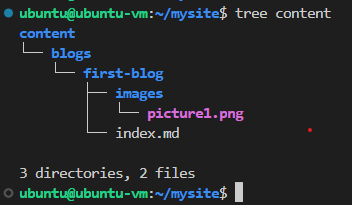
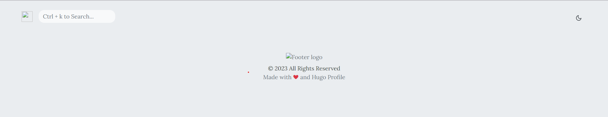
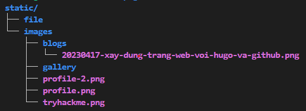
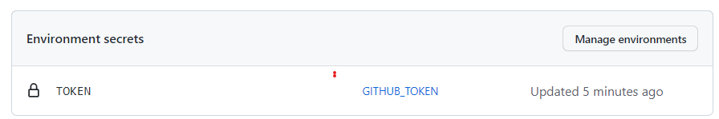

# Ý tưởng

Dự án xây dựng một trang web cá nhân là một ý tưởng đã từng ở trong đầu mình từ rất lâu. Là một dân IT, việc tạo ra một không gian riêng để chia sẻ những điều mà mình đam mê, những kiến thức mà mình tích luỹ, và những trải nghiệm mà mình đã trải qua luôn là một ý tưởng hấp dẫn đối với mình. Tuy nhiên, do công việc bận rộn và sự thiếu hụt kỹ năng lập trình frontend, dự án này đã bị hoãn lại trong một thời gian khá dài.

Tuy nhiên, vào gần đây, do có cơ hội nghiên cứu và tìm hiểu về Hugo, và mình cảm thấy rất hứng thú và tự tin để triển khai ý tưởng của mình một lần nữa.

Được đồng chí trong team admin VietAWS UG giới thiệu về Hugo lâu rồi nhưng gần đây mình mới được dịp tiếp xúc và tìm hiểu về nó, như thấy được đây là cơ hội để thực hiện ý tưởng, mình đã quyết định áp dụng ngay và xây dựng nên trang web này.

# Xây dựng trang web với hugo

Để xây dựng trang web với Hugo, bước đầu tiên vẫn là nắm vững tổng quan về nó (Bài viết chỉ là tổng quan chứ không đi sâu về mặt kĩ thuật nên mọi người muốn hiểu rõ thì chịu khó đọc document nha).

## Cài đặt Hugo

Mình sử dụng ubuntu để host nên sử dụng apt package manager và câu lệnh như sau:

```shell
sudo apt install hugo
```

Mọi người có thể tìm hiểu cách cái đặt ở trang [hugo installation](https://gohugo.io/installation/)

## Tạo khung sườn cho hugo

Sau khi cài đặt thì đi đến tạo website đầu tiên với hugo

```shell
hugo new site mysite
cd mysite
```

Hugo sẽ tạo 1 folder tên là mysite và đây là cấu trúc của folder mà hugo vừa tạo


## Themes

Thế là đã có khung sườn cho hugo. Công việc tiếp theo là tìm themes cho hắn. Vậy thì tìm themes ở đâu? ở trang [Hugo themes](https://themes.gohugo.io/) này nè

Sau khi lục lọi 1 hồi thì mình đã tìm đến [hugo-profile theme](https://hugo-profile.netlify.app/)


Sau khi xem xét qua phần giao diện và hiển thị tiếng việt thì vẫn thấy cái theme này trông quá ư là ổn nên quất luôn😘😘

## Cấu hình hugo

Chọn được theme rồi thì thêm nó vào trong hugo project thôi. Về lệnh thì do có chút khác biệt về phần themes nên mình sử câu lệnh hơi khác so với trang [Hugo quickstart](https://gohugo.io/getting-started/quick-start/) nên ai gặp lỗi thì có thể tham khảo document của Hugo

```shell
cd mysite
git init
git submodule add https://github.com/gurusabarish/hugo-profile.git themes/hugo-profile
cp themes/hugo-profile/exampleSite/config.yaml ./
hugo server
```

## Bài viết đầu tiên

Để lên bài đầu tiên thì đầu tiên vẫn phải là nghiên cứu qua cấu trúc của 1 blog được mình sử dụng



Muốn tìm hiểu kĩ hơn về phần này thì bạn có thể đọc qua về [Hugo page bundles](https://gohugo.io/content-management/page-bundles/) trong document của hugo.

Tìm hiều về cách cấu hình single page của tác giả theme

```shell
---
title: "Xây dựng website cá nhân với Hugo và GitHub" # này là title của trang web
date: 2023-04-17T00:00:00+07:00 # thời gian lên bài
draft: false # Cái này không biết nó có tác dụng gì
author: "Thạch Phạm"  # Tên tác giả, được hiển thị ở dưới title
tags: # phần tag này được hiển thị ở phía bên phải bên dưới phần table of content
  - Hugoweb
  - Github Action
  - StaticWeb
image: /images/blogs/20230417-xay-dung-trang-web-voi-hugo-va-github.png 
# ảnh bìa của bài viết được hiển thị ở phần danh sách bài viết và bên dưới title
description: "Trang web này được dựng lên như thế nào?"
# Phần mô tả này hông thấy được hiển thị
toc: # này là viết tắt của table of content, mặc định là true (có thể thị phần table of content ở phía bên phải)
---
<Nội dung bài viết được viết ở đây>
```

Thế là xem như đã tạo xong 1 hugo project cơ bản.

## Vấn đề gặp phải và giải pháp

Nhìn thì đơn giản vậy thôi, chứ do là newbie bên mảng này nên gặp bug cũng khá nhiều

## config.toml

Này là do mình lên document của Hugo copy mà không chịu đọc kĩ thế là mình tạo hugo project bằng những lệnh sau:

```shell
hugo new site website-src
cd website-src
git init
git submodule add https://github.com/gurusabarish/hugo-profile.git themes/hugo-profile
echo "theme = 'hugo-profile'" >> config.toml
cp themes/hugo-profile/exampleSite/config.yaml ./
hugo server
```

Thế là tạo 2 file config, cơ mà hugo nó lấy cấu hình ở file `config.toml` nên trang chủ của web dù mình sửa thế nào cũng chả hiển thị cái gì



Loay hoay 1 lúc thì mới tìm được vấn để, thế là phải xóa file `config.toml` đi.

Mọi người muốn hiểu rõ hơn về phần cấu hình này thì có thể đọc [Hugo configuration](https://gohugo.io/getting-started/configuration/)

## Hiển thị ảnh bìa

Hiển thị ảnh trong bài viết thì bình thường chứ hiển thị ảnh bìa thì nó hơi khác tí.

Nếu để link banner trong thuộc tính images của page là  `images/banner.png` thì lúc hiển thị danh sách bài viết sẽ không thấy ảnh bìa còn nều để là `<post>/images/banner.png` thì vào bên trong bài viết sẽ gặp lỗi hiển thị ảnh bìa. Thế là phải đi lục lại bài gốc của tác giả và anh ấy sử dụng địa chỉ tuyệt đối dạng `/images/banner.png` loay hoay tìm thư mục `images` thì phát hiện nó ở trong thư mục `static` bằng ở root directory của hugo project. Kiểm tra ngay và thấy mọi thứ đã oke. Và mình đã tạo nên thư mục `blogs` bên trong `images` dùng để lưu các banner của bài viết.



## Mình xóa git link đến resource của tác giả

Thay vì sử dụng `git submodule add https://github.com/gurusabarish/hugo-profile.git themes/hugo-profile` thì mình lại dùng `git clone https://github.com/gurusabarish/hugo-profile.git` sau đó `rm -rf .git`.

Bản thân có chỉnh sửa đôi chút qua theme source của tác giả nên sẽ không sử dụng `git submodule add ...` bởi như vậy thì github sẽ nhận diện git repo của người khác và sẽ tạo liên kết đến đó làm cho những chỉnh sửa của mình trở nên vô dụng.

Hơi có chút không tôn trọng bản quyền của tác giả nhưng thôi vậy dùng tạm 😁 chân thành xin lỗi ha 😘.

# Triển khai website lên github và cấu hình Github Action

Thế là xong phần web ở local, đưa em nó lên mạng thôi 😍

## Tạo thachpham2k.github.io

Phần này thì github viết hơi bị dễ hiểu luôn á, nên mọi người có thể tham khảo [Tạo static website với github](https://pages.github.com/)

Tóm tắt thì việc cần làm ở đây là tạo 1 github repository dạng `<username>.github.io`.

## Tạo website-src

Tương tự bước trước đó nhưng lần này thích đặt tên là gì cũng được, đây sẽ là nơi chưa source của hugo project.

## Tạo Personal Token

Personal token là gì? Tại sao lại phải tạo nó? Nó được sử dụng khi nào?

* GitHub Personal Access Token (hoặc còn được gọi là GitHub Personal Token) là một loại mã truy cập được cung cấp bởi GitHub để xác thực và ủy quyền các hoạt động trên GitHub. Nó cho phép người dùng thực hiện các hoạt động như tạo, đọc, cập nhật và xóa các kho lưu trữ, quản lý issues, pull requests, quản lý các settings và các hoạt động khác liên quan đến tài khoản GitHub.

* PAT sẽ được sử dụng trong Github Action. Ở bước cuối cùng, khi muốn đẩy nội dung bên trong thư mục `public` của hugo qua thachpham2k.github.io repository thì phải cho Github bot quyền để nó được phép đẩy code lên đó. Và quyền đó sẽ được cấu hình đi kèm với PAT và github bot sẽ dùng nó để có quyền đẩy code lên repo.

Để tạo PAT thì:

1. Truy cập [Github Personal Access Token](https://github.com/settings/tokens) hoặc vào github -> setting -> developer setting -> Personal Access Token -> Tokens (classic)
2. Tạo Token bằng cách click vào `Generate new token` rồi chọn `Generate new token (classic)` rồi nhập tên, cài đặt hạn sử dụng và quyền hạn cho nó.

Sau khi tạo thì sẽ đến bước thêm Token vào `secret environment` để bot có thể biết mà sử dụng.

1. Truy cập hugo project repository
2. Setting -> Secrets and variables -> Actions
3. Tại đây chọn `New repository secret` Ứng dụng sẽ đều hướng qua trang tạo environments 
4. Tại trang environments tạo 1 environments mới có tên là `GITHUB_TOKEN`
5. Bên trong giao diện của Environment tạo 1 `environment secret` có tên là `TOKEN` và nhập PAT được tạo trước đó và phần value
6. Quanh lại giao diện Setting -> Secrets and variables -> Actions sẽ thấy 1 Enviromnet token được tạo có tên là `GITHUB_TOKEN`



Trong file cấu hình github action, nếu muốn sử dụng github PAT thì phải khai báo dạng
```
personal_token: ${{ secrets.GITHUB_TOKEN }}
```

## Tạo Github Deploy key

Nếu không muốn sử dụng PAT thì có 1 tùy chọn khác đó là sử dụng ssh key. Để có thể dụng cách này đầu tiên cần có 1 ssh key có thể dụng cho github.

Sử dụng ssh-keygen để tạo key

```shell
ssh-keygen -t ed25519 -C "phamthach2506@gmail.com"
```


ở bước `Enter file in which to save the key (C:\Users\phamt/.ssh/id_ed25519): abcde` nếu không nhập gì thì ssh sẽ tạo ra key có tên là `id_ed25519` và `id_ed25519.pub` còn ở đây mình có nhập `abcde` thì sẽ tạo ra file key có tên là `id_abcde` và `id_abcde.pub`.

Sau khi tạo key thì tiến hành cấu hình tren github

* Upload private key

1. Truy cập repo hugo project (website-src)
2. Setting -> Secrets and variables -> Actions
3. Tại đây chọn `New repository secret`
4. Nhập name là `PRIVATEKEY` còn value là nội dung của file `id_adcde` vừa được tạo


* Upload public key

1. Truy cập website repo (thachpham2k.github.io)
2. Setting -> Deploy key
3. Add deploy key
4. Nhập title là PUBLICKEY và Key là nội dung của file `id_abcde.pub`
5. Click vào `Allow write access`

* Sử dụng: Trong file cấu hình github action, nếu muốn sử dụng github PAT thì phải khai báo dạng

```
deploy_key: ${{ secrets.privatekey }}
```

## Tạo Github action

Đầu tiên là tìm đến source repo (website-src) và chọn đến tab Action

Ở đây tìm đến mục tìm kiếm workflow và nhập `Simple workflow` 

Bên trong file `blank.yml` chỉnh sửa nội dung thành như thế này

```
# This is a basic workflow to help you get started with Actions

name: CI

# Controls when the workflow will run
on:
  # Triggers the workflow on push or pull request events but only for the "main" branch
  push:
    branches: [ "main" ]
  pull_request:
    branches: [ "main" ]

  # Allows you to run this workflow manually from the Actions tab
  workflow_dispatch:
# A workflow run is made up of one or more jobs that can run sequentially or in parallel
jobs:
  # This workflow contains a single job called "build"
  build:
    # The type of runner that the job will run on
    runs-on: ubuntu-latest
    permissions: write-all

    # Steps represent a sequence of tasks that will be executed as part of the job
    steps:
      # Checks-out your repository under $GITHUB_WORKSPACE, so your job can access it
      - uses: actions/checkout@v3
        
#       - name: Update themes
#         run: git submodule update --init --recursive

      - name: Setup Hugo
        uses: peaceiris/actions-hugo@v2
        with:
          hugo-version: 'latest'
          
      - name: build
        run: hugo -v
      
      - name: Deploy
        uses: peaceiris/actions-gh-pages@v3.9.3
        with:
          # personal_token: ${{ secrets.GITHUB_TOKEN }}
          deploy_key: ${{ secrets.privatekey }}
          external_repository: thachpham2k/thachpham2k.github.io
          publish_dir: ./public
          # user_name: thachpham2k
          # user_email: phamthach2506@gmail.com
          publish_branch: master
          allow_empty_commit: true
```

Phần này có khá nhiều thứ, lười giải thích quá. Mọi người commit file và đợi kết quả thôi.

## Vấn đề gặp phải và giải pháp

Mục này xuất hiện gần như là điều hiển nhiên rồi, newbie mà, làm sao để tránh khỏi lỗi đây

## Sử dụng github token

Đầu tiên mình sử dụng github token (được recommend sử dụng vì tính bảo mật) nhưng mà ở project này Github token không đáp ứng đủ quyền (quyền write) nên mình phải chuyển qua xài PAT.

## Sử dụng PAT

Vì Github token không đáp ứng được nhu cầu nên mình chuyển qua sử dụng PAT, tuy nhiên vấn đề gần tương tự đã xảy ra là mình cấu hình token và khi chạy cứ nhận về Permission deny. Lười test các permission quá nên mình chuyển qua xài Deploy key 🤣😂 để hôm này rảnh quay lại test cái PAT (hôm nào này hơi xa đó).

## Xây dựng file build cho github action

Mình gặp chút vấn đề khi tạo file cấu hình git action.

Cụ thể là khi lấy giá trị token mình sử dụng `personal_token: ${{ secrets.TOKEN }}` thay vì `personal_token: ${{ secrets.GITHUB_TOKEN }}` làm loay hoay chả biết sai ở đâu (công nhận lúc đó hơi ngáo thật).

# Lời kết

Bài viết ghi lại phần nào quá trình mình tạo nên trang web này. Cũng là lần đầu chơi với Hugo cũng như git action và chưa dành nhiều thời gian nghiên cứu kĩ nên kiến thức sẽ có hơi sơ xài hay có thể sai mong mọi người có thể góp ý qua fb hoặc gmail mình để ở cuối trang web 

Chân thành cảm ơn đã đọc hế bài viết. BYE👋👋👋