# Ý tưởng

Hôm trước có lên bài về việc tạo static web với Hugo với công cụ là Github và Github Action, chúng ta có thể thực hiện tương tự với các dịch vụ của AWS. Ví dụ, ta có thể sử dụng Amazon S3 để lưu trữ trang web và Amazon CloudFront để phân phối nội dung. Ta cũng có thể sử dụng AWS CodePipeline và AWS CodeBuild để tự động hóa việc triển khai trang web mỗi khi có sự thay đổi trong mã nguồn. Đây là một cách rất tiện lợi và hiệu quả để quản lý và cập nhật website của bạn mà không cần phải lo lắng về việc cài đặt và vận hành server.

Đi kèm với bài Blog mình có 1 video về quá trình tạo website với Hugo sử dụng các dịch vụ của AWS



Bài viết này sẽ đi sâu vào việc sử dụng các dịch vụ của AWS để hổ trợ việc triển khai một website tĩnh sử dụng Hugo lên S3 Static Web.

# Tạo S3 Static web

Bước đầu tiên vẫn là tạo trang web trước, nội dung tính sau 😂. Để host trang web tĩnh trên AWS, chúng ta có thể sử dụng tính năng Static website hosting của Amazon S3. Tuy nhiên, trước khi sử dụng tính năng này, chúng ta cần phải tạo một bucket S3 để lưu trữ các file của trang web. Sau đó, ta có thể cấu hình các quyền truy cập cho bucket S3 để cho phép trang web được truy cập từ bên ngoài. Việc sử dụng tính năng **Static website hosting** của S3 sẽ giúp cho việc host trang web trở nên đơn giản và hiệu quả hơn.

## Tạo S3 Bucket

Việc cần thực hiện là tạo một S3 bucket với tên và tag nhất định. Tuy nhiên, để dễ dàng cho việc lưu trữ và chia sẻ website, cần phải kích hoạt **Object Ownership** và vô hiệu hóa các tùy chọn **Block Public Access** trên bucket.

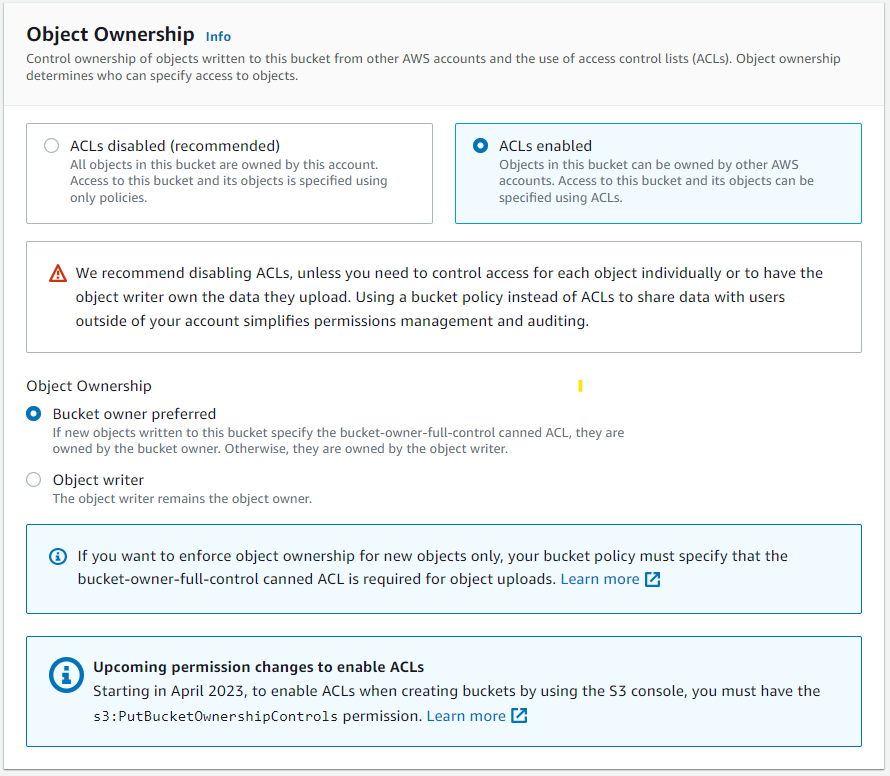

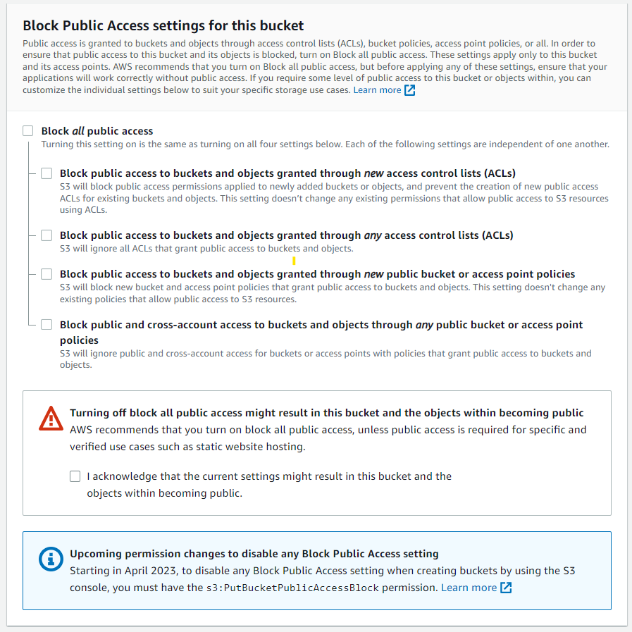

## S3 Static Web Hosting

Để kích hoạt tính năng này, trước tiên bạn cần chọn vào S3 bucket muốn bật tính năng, sau đó chọn tab Properties, kéo xuống cuối trang và chọn Enable Static Web Hosting, sau đó nhập `index.html` vào phần **Index document**.


Tuy nhiên, khi truy cập vào S3 static web bằng tên miền, có thể gặp phải lỗi 403. Lỗi này xảy ra do S3 bucket chưa được public, do đó người dùng bên ngoài không thể truy cập được.

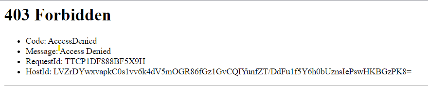

## Thêm quyền getObject

Để cho người dùng có thể truy cập vào trang web static trên S3 mà không gặp phải lỗi 403, cần phải thêm quyền truy cập cho bucket. Việc này có thể được thực hiện bằng cách truy cập vào S3 bucket, chọn tab **Permissions**, và chọn phần **Bucket policy**. Sau đó, nhập đoạn mã sau vào phần policy (nhớ điền S3 Bucket name vào phần ARN nha).

```json
{
	"Version": "2012-10-17",
	"Statement": [
		{
			"Sid": "Statement1",
			"Principal": "*",
			"Effect": "Allow",
			"Action": [
				"s3:GetObject"
			],
			"Resource": [
				"arn:aws:s3:::<S3 Bucket name>/*"
			]
		}
	]
}
```

Lúc này thử truy cập bằng S3 Static web url thì sẽ gặp lỗi 404 Not Found vì nội dung của trang web đang bị trống (không tìm thấy file index.html)

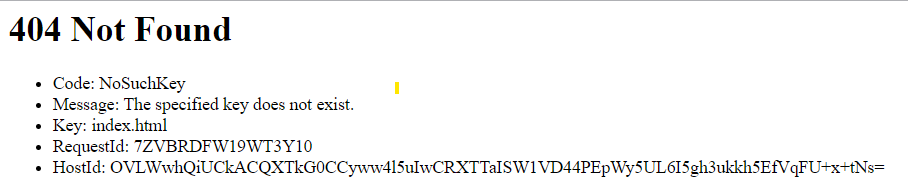

# Tạo AWS Codepipeline

Bạn muốn triển khai trang web tự động mỗi khi cập nhật mã nguồn (trên Code Commit)? Hãy dùng AWS CodePipeline và AWS CodeBuild nhé!

## AWS CodeCommit

Trước tiên, bạn cần có một nơi chứa các file tĩnh của trang web. Bạn có thể tạo một repository trên CodeCommit để lưu mã nguồn của website Hugo. Bạn có thể dùng giao diện web hoặc dòng lệnh để làm việc này (Ở đây mình xài console cho nó thân thiện 😁). 

Đầu tiên truy cập giao diện console của AWS và tìm đến phần [Commit](https://ap-southeast-1.console.aws.amazon.com/codesuite/codecommit/repositories)

Tiếp theo, bạn nhấn vào **Create Repository** và điền thông tin để tạo repository (🤣Easy game🤣🤣).

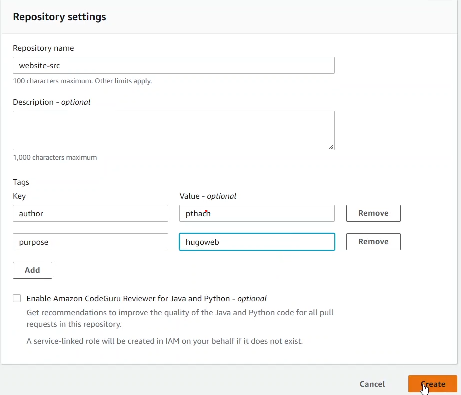

Khi đã tạo xong, bạn clone repository về máy của bạn và chép các file của website Hugo vào thư mục repository. Hướng dẫn vậy nhưng mình làm hơi khác tí, đầu tiên mình clone resource từ github về sau đó thay đổi cấu hình của git cho phù hợp và sử dụng bằng các lệnh

```shell
git clone git@github.com:thachpham2k/website-src.git
cd website-src/
rm -rf .git
rm -rf .github
git init
git remote add origin https://git-codecommit.ap-southeast-1.amazonaws.com/v1/repos/hugo-codecommit
git add .
git commit -m "first commit"
git checkout -b main
git push origin main
```

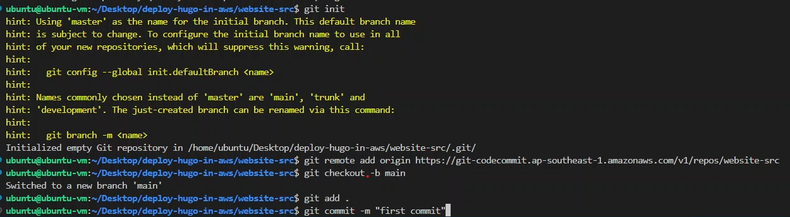

Tuy nhiên đâu phải muốn commit là được commit đâu. Lưu ý rằng bạn cần phải đăng nhập để commit code. Bạn phải dùng AccessToken để đăng nhập vào AWS Cli (bằng lệnh `aws configure`) rồi mới dùng Credential Helper để đăng nhập:

```shell
git config --global credential.helper '!aws codecommit credential-helper $@'
git config --global credential.UseHttpPath true
```


Phần này mình bỏ qua về Hugo resource, nếu muốn tìm hiểu thêm bạn chịu khó xem lại bài [Blog](https://thachpham2k.github.io/blogs/20230417-xay-dung-trang-web-voi-hugo-va-github/#t%E1%BA%A1o-website-src) trước của mình nhé.

## AWS CodeBuild

Trước khi đi vào tạo CodeBuild thì phải xây dựng file build trước đã. Tạo 1 file có tên là `buildspec.yml` và lưu nó ở trong repository được tạo ở bước trước. Và nội dung của file build như sau:

```yml
version: 0.2
phases:
  install:
    commands:
      - apt-get update -y
      - echo Installing hugo
      - curl -L -o hugo.deb https://github.com/gohugoio/hugo/releases/download/v0.111.3/hugo_0.111.3_linux-amd64.deb
      - dpkg -i hugo.deb
      - hugo version
  build:
    commands:
      - hugo -v
artifacts:
  files:
    - '**/*'
  base-directory: 'public'
```

Sau khi có file buildspec.yml, bạn có thể truy cập vào [CodeBuild](https://ap-southeast-1.console.aws.amazon.com/codesuite/codebuild/projects) và chọn **Create build project**. Bạn sẽ cần điền các thông tin như sau:

Cấu hình CodeBuild

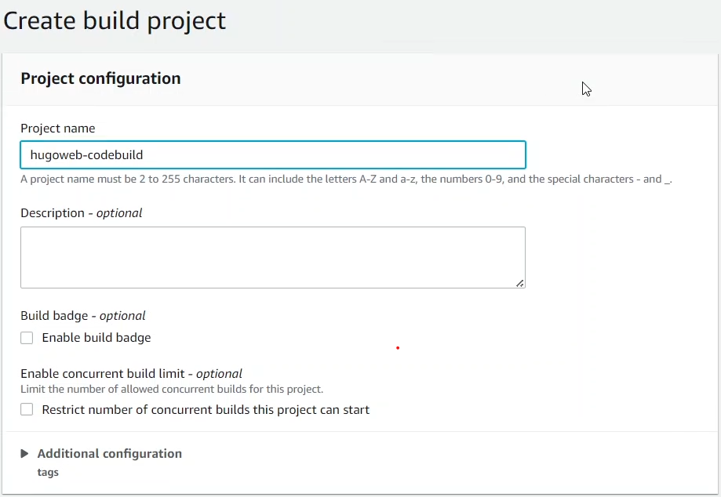

Mã nguồn

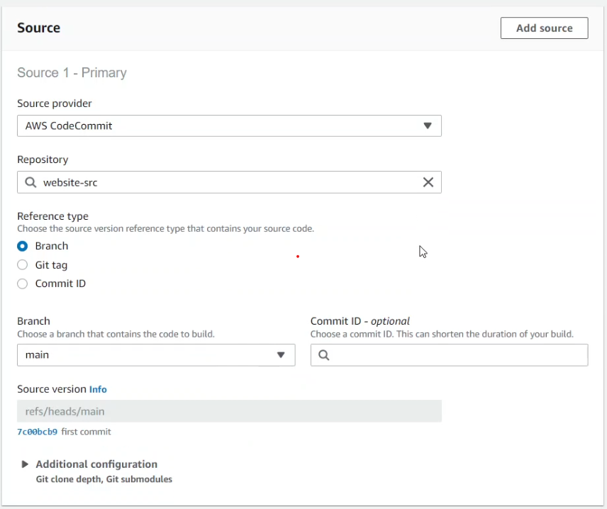

Môi trường build

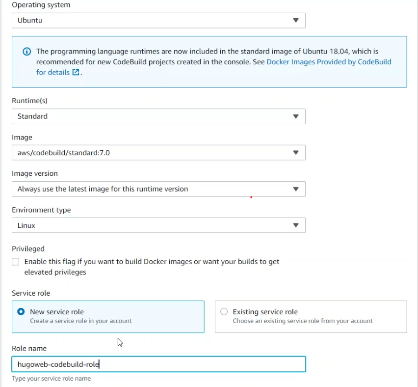

Bên cạnh đó, bạn cũng cần chỉ định vị trí của file buildspec.yml trong repository của mình. Sau khi hoàn tất, bạn có thể nhấn **Create build project** để tạo CodeBuild.

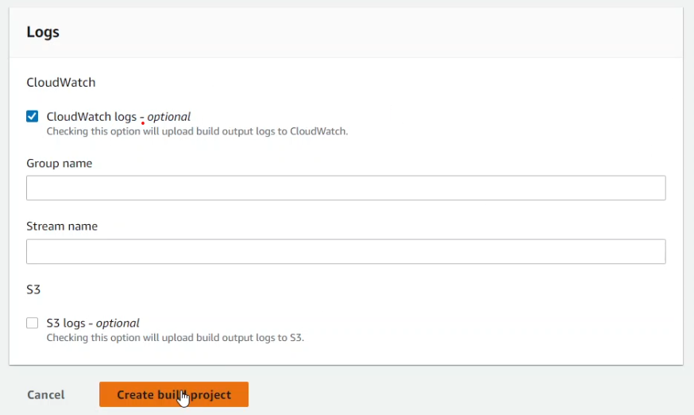

Để kiểm tra xem CodeBuild hoạt động như thế nào, bạn có thể nhấn **Start build** và xem kết quả.

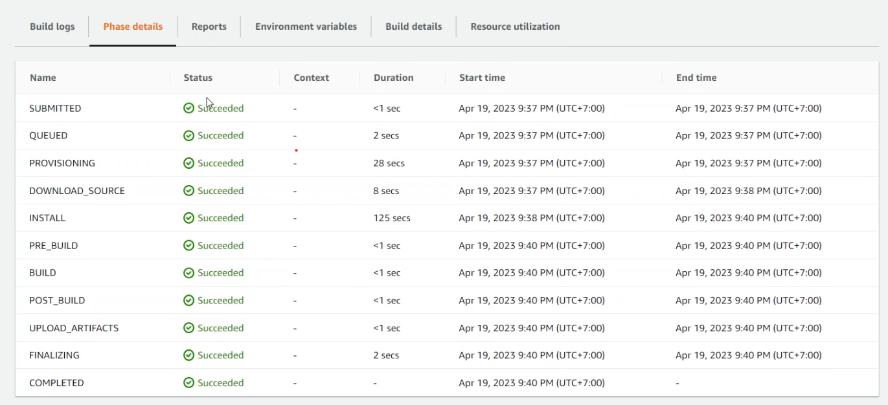

## AWS CodePipeline

Tạo một pipeline trên CodePipeline để tạo một quy trình liên tục từ mã nguồn đến Website. Để cấu hình CodePipeline cần phải cấu hình các thành phần sau:

Tên pipeline

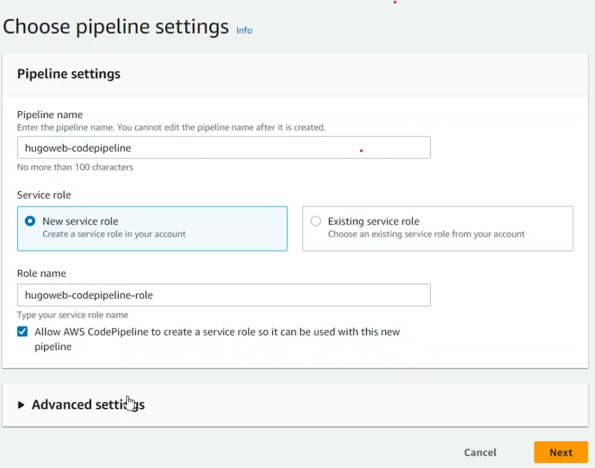

Mã nguồn (CodeCommit)

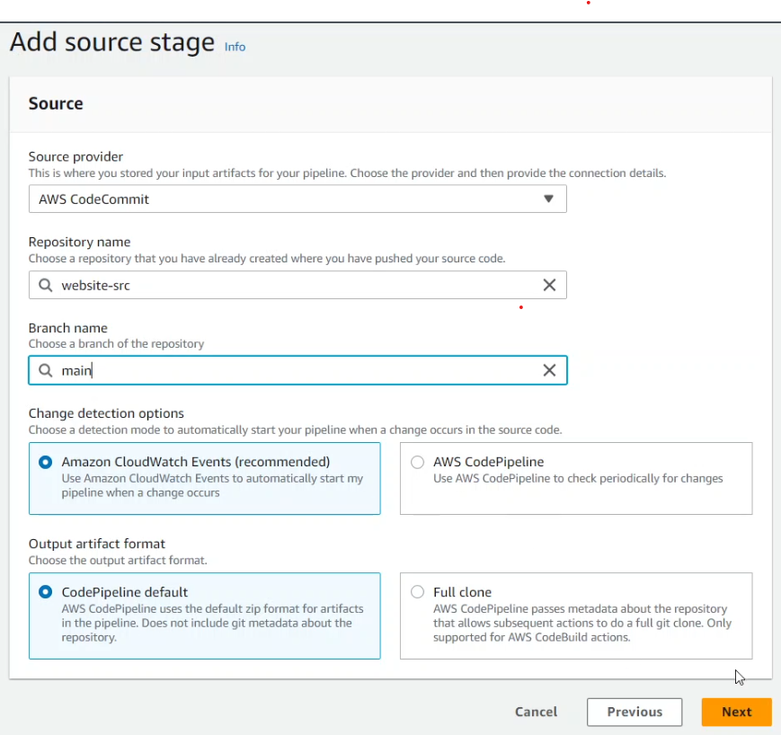

Giai đoạn build (CodeBuild)

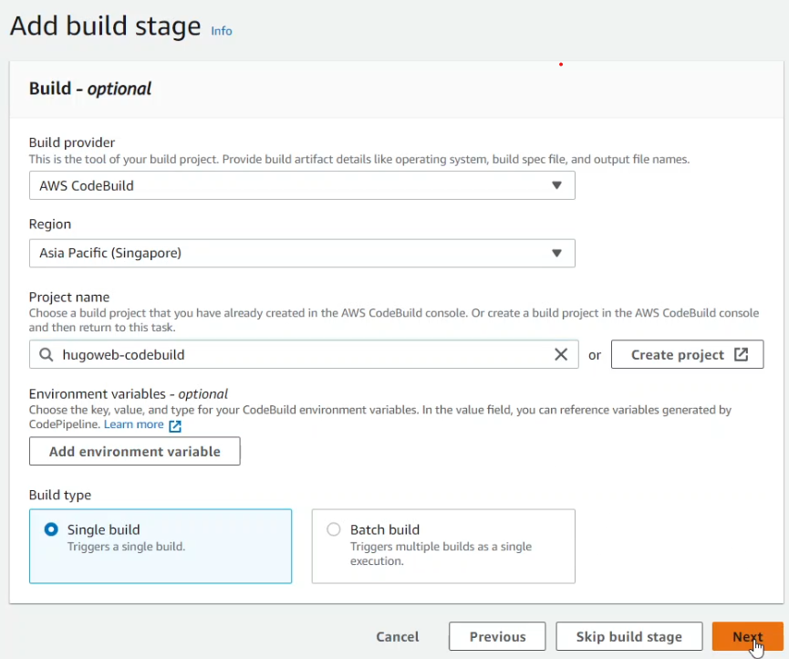

Giai đoạn deploy (S3)

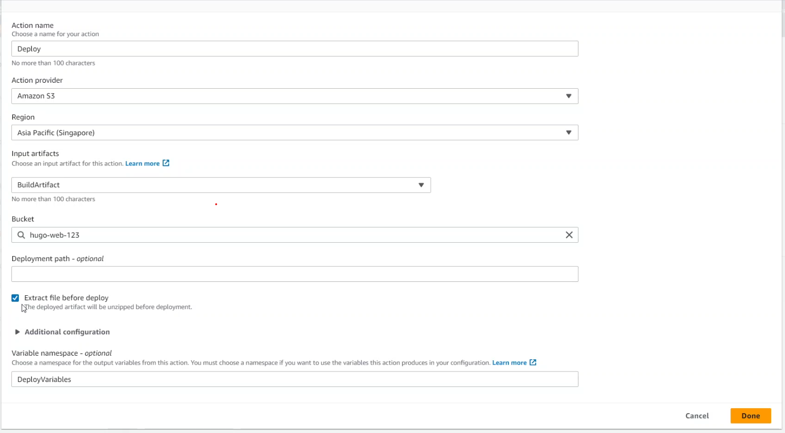

Khi bạn hoàn thành việc tạo pipeline, bạn có thể theo dõi tiến trình của các giai đoạn và xem kết quả triển khai trên S3.

Kiểm tra xem các tệp đã được cài đặt và chuyển sang S3 chưa

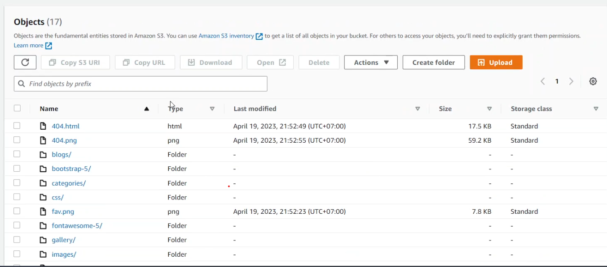

# Vấn đề gặp phải và giải pháp

## Không thể push code lên CodeCommit

Vấn đề này là do bạn chưa thực hiện bước xác thực của AWS đấy. Mình biết 2 các xác thực AWS để sử dụng AWS CodeCommit:

* Sử dụng Git credentials
* Sử dụng AWS Access Token

1. Sử dụng Git Credentials

2. Sử dụng AWS Access Tokens

Với cách này, bạn cần có một Access Token và một Credential Helper. Access Token là một chuỗi ký tự dùng để xác thực danh tính của bạn khi bạn gửi mã nguồn lên CodeCommit. Credential Helper là một công cụ giúp bạn quản lý Access Token một cách tự động.

Để lấy Access Token, bạn có thể sử dụng giao diện Console bằng cách:

Truy cập **Security credentials**

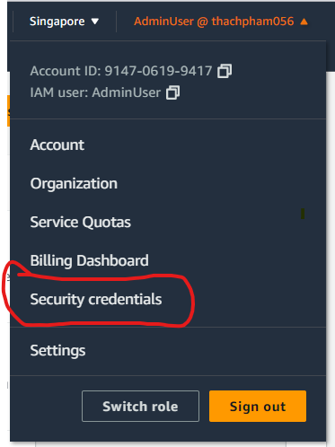

hoặc [link](https://us-east-1.console.aws.amazon.com/iamv2/home#/security_credentials?section=IAM_credentials)

Sau đó di chuyển đến phần **Access Keys** và tạo Access Keys (nhớ lưu lại thông tin Access key để sử dụng ở bước tiếp theo nhé).

Tiếp theo, bạn cần cài đặt AWS CLI (Command Line Interface) trên máy tính của bạn. Bạn có thể tải AWS CLI từ trang web chính thức của AWS hoặc sử dụng các công cụ quản lý gói phần mềm như pip, npm, homebrew... để cài đặt.

Sau khi cài đặt xong AWS CLI, bạn cần cấu hình thông tin tài khoản AWS của bạn bằng lệnh `aws configure`. Bạn sẽ cần nhập các thông tin sau:

- AWS Access Key ID: là một chuỗi ký tự dùng để xác định tài khoản AWS của bạn.
- AWS Secret Access Key: là một chuỗi ký tự dùng để xác thực tài khoản AWS của bạn.
- Default region name: là tên của vùng mà bạn muốn sử dụng các dịch vụ của AWS. Ví dụ: ap-southeast-1 là tên của vùng Singapore.
- Default output format: là định dạng của kết quả trả về khi bạn sử dụng AWS CLI. Bạn có thể chọn json, text hoặc table.

Bạn có thể tìm thấy các thông tin về AWS Access Key ID và AWS Secret Access Key trong phần [IAM](https://console.aws.amazon.com/iam/home) của giao diện console của AWS. Bạn nên tạo một IAM User riêng cho việc sử dụng CodeCommit và gán cho nó các quyền hạn cần thiết.

Sau khi cấu hình xong AWS CLI, bạn có thể lấy Access Token bằng lệnh `aws codecommit get-login-password`. Lệnh này sẽ trả về một chuỗi ký tự là Access Token của bạn.

Để sử dụng Credential Helper, bạn cần cài đặt Git trên máy tính của bạn (nếu chưa có). Sau đó, bạn cần thiết lập Credential Helper bằng lệnh `git config --global credential.helper '!aws codecommit credential-helper $@'`. Lệnh này sẽ cho phép Git sử dụng Credential Helper để lấy và lưu trữ Access Token khi bạn gửi mã nguồn lên CodeCommit.

Cuối cùng, bạn có thể clone repository từ CodeCommit về máy tính của bạn bằng lệnh `git clone https://git-codecommit.<region>.amazonaws.com/v1/repos/<repository-name>`. Bạn cần thay thế <region> bằng tên vùng mà bạn đã chọn khi cấu hình AWS CLI và <repository-name> bằng tên repository mà bạn đã tạo trên CodeCommit.

Sau khi clone xong, bạn có thể copy các file của website Hugo vào thư mục của repository và gửi mã nguồn lên CodeCommit bằng các lệnh `git add .`, `git commit -m "<message>"` và `git push origin main`.

## Tùy chọn **Extract file before deploy**


Khi mình tạo AWS CodePipeline, ở deploy stage mình đã có chút nhầm lần phần *Extract file before deploy*. Sau khi tìm hiểu thì khi mình bấm vào tùy chọn này thì lúc đẩu sang S3 Artifact đã được giải nén và bên cạnh đó tùy chọn **Deployment path** sẽ giúp chúng ta tùy chỉnh vị trí mà file được giải nén được đưa đến trong S3 Bucket

# Lời kết

Đến đây, bạn đã hoàn thành việc triển khai website Hugo lên S3 Static Web bằng CodeCommit, CodeBuild và CodePipeline. Bạn có thể thử thay đổi nội dung của website trên CodeCommit và xem pipeline tự động chạy và cập nhật website trên S3. Chúc các bạn thành công!